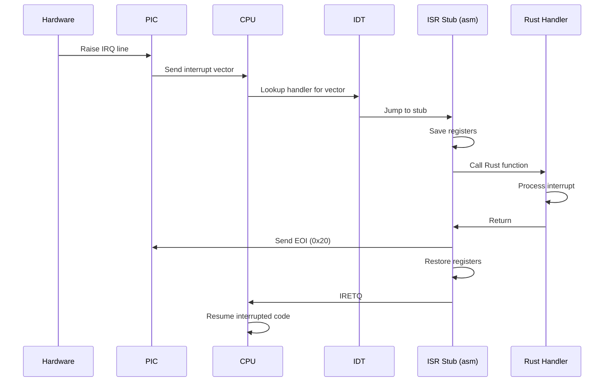

## Overview

Portix OS implements a complete interrupt handling system including:

- **Interrupt Descriptor Table (IDT)** with 256 entries
- **CPU exception handlers** (divide-by-zero, page fault, general protection, etc.)
- **Hardware interrupt handlers** (timer, keyboard, mouse)
- **Programmable Interrupt Controller (PIC)** remapping
- **Dedicated double-fault stack** via Interrupt Stack Table (IST)

<Info>
  All interrupt handlers run in **ring 0** (kernel mode) with interrupts disabled during handler execution to prevent re-entrancy issues.
</Info>

## IDT Structure

### Descriptor Format

Each IDT entry is a 16-byte structure:

```rust kernel/src/arch/idt.rs
#[repr(C, packed)]
#[derive(Copy, Clone)]
struct IdtEntry {
    offset_low:  u16,    // Handler address bits [15:0]
    selector:    u16,    // Code segment selector (0x08)
    ist:         u8,     // Interrupt Stack Table index
    type_attr:   u8,     // Type and attributes
    offset_mid:  u16,    // Handler address bits [31:16]
    offset_high: u32,    // Handler address bits [63:32]
    reserved:    u32,    // Must be zero
}
```

### Gate Types

```rust kernel/src/arch/idt.rs
const GATE_INT: u8 = 0x8E;  // Interrupt gate: present, DPL=0, type=0xE
```

| Bit | Field | Value | Meaning |
|-----|-------|-------|----------|
| 7 | P (Present) | 1 | Descriptor is valid |
| 6-5 | DPL | 00 | Privilege level (ring 0) |
| 4 | 0 | 0 | Storage segment flag |
| 3-0 | Type | 1110 | 64-bit interrupt gate |

### IDT Initialization

The IDT is populated during `init_idt()` at kernel startup (idt.rs:91):

```rust kernel/src/arch/idt.rs
#[no_mangle]
static mut IDT: [IdtEntry; 256] = [IdtEntry::new(); 256];

pub unsafe fn init_idt() {
    // ... TSS and GDT setup ...

    // CPU exception handlers (0-19)
    macro_rules! h { 
        ($f:expr) => { 
            core::mem::transmute::<unsafe extern "C" fn(), u64>($f) 
        } 
    }
    
    IDT[ 0].set_handler(h!(isr_0));    // Divide by zero
    IDT[ 1].set_handler(h!(isr_1));    // Debug
    IDT[ 2].set_handler(h!(isr_2));    // NMI
    IDT[ 3].set_handler(h!(isr_3));    // Breakpoint
    IDT[ 4].set_handler(h!(isr_4));    // Overflow
    IDT[ 5].set_handler(h!(isr_5));    // Bound range
    IDT[ 6].set_handler(h!(isr_6));    // Invalid opcode
    IDT[ 7].set_handler(h!(isr_7));    // Device not available
    IDT[ 8].set_handler_ist1(h!(isr_8)); // Double fault (IST1)
    IDT[10].set_handler(h!(isr_10));   // Invalid TSS
    IDT[11].set_handler(h!(isr_11));   // Segment not present
    IDT[12].set_handler(h!(isr_12));   // Stack fault
    IDT[13].set_handler(h!(isr_13));   // General protection
    IDT[14].set_handler(h!(isr_14));   // Page fault
    IDT[16].set_handler(h!(isr_16));   // x87 FPU error
    IDT[17].set_handler(h!(isr_17));   // Alignment check
    IDT[18].set_handler(h!(isr_18));   // Machine check
    IDT[19].set_handler(h!(isr_19));   // SIMD exception

    // Hardware IRQ handlers (32-47)
    let irq0  = core::mem::transmute::<unsafe extern "C" fn(), u64>(irq0_handler);
    let irq_m = core::mem::transmute::<unsafe extern "C" fn(), u64>(irq_stub_master);
    let irq_s = core::mem::transmute::<unsafe extern "C" fn(), u64>(irq_stub_slave);
    
    IDT[0x20].set_handler(irq0);  // IRQ0: PIT timer
    for i in 0x21..=0x27_usize { 
        IDT[i].set_handler(irq_m);  // IRQ1-7: Master PIC
    }
    for i in 0x28..=0x2F_usize { 
        IDT[i].set_handler(irq_s);  // IRQ8-15: Slave PIC
    }

    // Load IDTR
    IDT_PTR.limit = (core::mem::size_of::<[IdtEntry; 256]>() - 1) as u16;
    IDT_PTR.base  = core::ptr::addr_of!(IDT) as u64;
    asm!("lidt [{p}]", p = in(reg) core::ptr::addr_of!(IDT_PTR),
         options(nostack, preserves_flags, readonly));

    // Enable interrupts
    asm!("sti", options(nostack, preserves_flags));
}
```

<Note>
  Exception 8 (double fault) uses a **dedicated stack** (IST1) to ensure it can always execute even if the main kernel stack is corrupted.
</Note>

## GDT and TSS Setup

### Global Descriptor Table

The GDT is reloaded during IDT initialization to include the TSS descriptor:

```rust kernel/src/arch/idt.rs
#[repr(C, align(16))]
struct Gdt { 
    null: u64,      // 0x00: Null descriptor
    code64: u64,    // 0x08: 64-bit code segment
    data64: u64,    // 0x10: 64-bit data segment
    tss_low: u64,   // 0x18: TSS descriptor (low)
    tss_high: u64   // 0x20: TSS descriptor (high)
}

static mut GDT: Gdt = Gdt {
    null:   0x0000_0000_0000_0000,
    code64: 0x00AF_9A00_0000_FFFF,  // L=1, D=0, P=1, DPL=0, code
    data64: 0x00CF_9200_0000_FFFF,  // P=1, DPL=0, data
    tss_low: 0, tss_high: 0,        // Filled at runtime
};
```

### Task State Segment

The TSS provides the IST1 stack pointer for double fault handling:

```rust kernel/src/arch/idt.rs
#[repr(C, packed)]
struct Tss {
    _res0:      u32,
    rsp:        [u64; 3],  // RSP for privilege levels 0-2
    _res1:      u64,
    ist:        [u64; 7],  // Interrupt Stack Table entries
    _res2:      u64,
    _res3:      u16,
    iomap_base: u16,
}

static mut DF_STACK: Stack16K = Stack16K([0u8; 16384]);

static mut TSS: Tss = Tss {
    _res0:0, rsp:[0;3], _res1:0, ist:[0;7], _res2:0, _res3:0,
    iomap_base: core::mem::size_of::<Tss>() as u16,
};
```

During initialization, IST1 is configured:

```rust kernel/src/arch/idt.rs
// Set IST1 for double fault
let df_top = (core::ptr::addr_of!(DF_STACK) as *const u8)
    .add(core::mem::size_of::<Stack16K>()) as u64;
TSS.ist[0] = df_top;

// Build TSS descriptor
let base  = core::ptr::addr_of!(TSS) as u64;
let limit = (core::mem::size_of::<Tss>() - 1) as u64;
GDT.tss_low =
      (limit  & 0x0000_FFFF)
    | ((base  & 0x00FF_FFFF) << 16)
    | 0x0000_8900_0000_0000_u64  // Present, Type=9 (available TSS)
    | ((limit & 0x000F_0000) << 32)
    | ((base  & 0xFF00_0000) << 32);
GDT.tss_high = (base >> 32) & 0xFFFF_FFFF;

// Load TSS selector
asm!("ltr ax", in("ax") 0x18_u16, options(nostack, preserves_flags));
```

## PIC Remapping

The 8259 PIC is remapped during Stage 2 bootloader (stage2.asm:354) to avoid conflicts with CPU exceptions:

```asm boot/stage2.asm
; Remap PIC: Master 0x20-0x27, Slave 0x28-0x2F
cli
mov al, 0x11        ; ICW1: Initialize in cascade mode
out 0x20, al        ; Master PIC command
out 0xA0, al        ; Slave PIC command
out 0x80, al        ; I/O delay

mov al, 0x20        ; ICW2: Master offset 0x20 (IRQ0 -> INT 0x20)
out 0x21, al
out 0x80, al

mov al, 0x28        ; ICW2: Slave offset 0x28 (IRQ8 -> INT 0x28)
out 0xA1, al
out 0x80, al

mov al, 0x04        ; ICW3: Master has slave on IRQ2
out 0x21, al
out 0x80, al

mov al, 0x02        ; ICW3: Slave cascade identity
out 0xA1, al
out 0x80, al

mov al, 0x01        ; ICW4: 8086 mode
out 0x21, al
out 0xA1, al
out 0x80, al

mov al, 0xFF        ; Mask all IRQs initially
out 0x21, al
out 0xA1, al
```

<Accordion title="Why Remap the PIC?">
  By default, the PIC uses IRQ0-15 mapped to INT 0x00-0x0F. However, Intel reserves INT 0x00-0x1F for CPU exceptions. Without remapping:
  
  - IRQ0 (timer) would conflict with INT 0x00 (divide by zero)
  - IRQ8 (RTC) would conflict with INT 0x08 (double fault)
  
  Remapping moves hardware IRQs to INT 0x20-0x2F, avoiding this conflict.
</Accordion>

During kernel initialization, only IRQ0 (PIT timer) is unmasked (idt.rs:162):

```rust kernel/src/arch/idt.rs
// Unmask IRQ0 (PIT) only
core::arch::asm!("out 0x21, al", in("al") 0xFEu8, options(nostack, nomem));
core::arch::asm!("out 0xA1, al", in("al") 0xFFu8, options(nostack, nomem));
```

## ISR Stubs (Assembly)

Low-level ISR stubs are defined in `arch/isr.asm` and linked into the kernel. They perform minimal setup before calling Rust handlers:

```asm kernel/src/arch/isr.asm
extern isr_page_fault
extern crash_frame

global isr_14
isr_14:  ; Page Fault (#PF)
    cli
    
    ; Save error code
    pop rax
    
    ; Save all registers to crash_frame
    mov [crash_frame + 32], rax   ; RAX
    mov [crash_frame + 40], rbx   ; RBX
    mov [crash_frame + 48], rcx   ; RCX
    ; ... (all other GPRs) ...
    
    ; Save RIP, RSP, RFLAGS from interrupt stack
    pop qword [crash_frame + 0]   ; RIP
    pop rax                        ; CS (discard)
    pop qword [crash_frame + 16]  ; RFLAGS
    pop qword [crash_frame + 8]   ; RSP
    
    ; Mark frame as valid
    mov byte [crash_frame + 152], 1
    
    ; Call Rust handler with error code
    mov rdi, [crash_frame + 32]  ; EC in RDI
    call isr_page_fault
    
    ; Handler never returns
    cli
    hlt
```

<Warning>
  Exception handlers that receive an error code must pop it from the stack before accessing the interrupt frame. Exceptions with error codes: 8, 10-14, 17, 21, 29, 30.
</Warning>

## Exception Handlers

### Page Fault (#PF)

The page fault handler displays detailed diagnostic information:

```rust kernel/src/arch/isr_handlers.rs
#[no_mangle]
extern "C" fn isr_page_fault(ec: u64) {
    let cr2: u64;
    unsafe { 
        core::arch::asm!("mov {r}, cr2", r = out(reg) cr2, 
                        options(nostack, preserves_flags)); 
    }
    
    let f = frame();
    let mut c = Console::new();
    let (w, h) = (c.width(), c.height());
    
    // Render diagnostic screen
    // ... (graphics code omitted) ...
    
    let cause = if cr2 < 0x1000 { 
        "Null pointer / acceso a pagina 0" 
    } else if cr2 > 0xFFFF_8000_0000_0000 { 
        "Acceso a espacio de kernel desde usuario" 
    } else if cr2 == f.rip { 
        "Instruccion no ejecutable (NX bit activo)" 
    } else { 
        "Pagina no presente o sin permisos de acceso" 
    };
    
    c.write_at("CAUSA PROBABLE", lp, 158, pal::MID);
    c.write_at(cause, lp, 172, pal::PF_BLUE);
    
    c.present(); 
    halt_loop()
}
```

The error code bits are decoded:

| Bit | Name | Meaning if Set |
|-----|------|----------------|
| 0 | P | Page was present (protection violation) |
| 1 | W | Access was a write |
| 2 | U | Access was from user mode (CPL=3) |
| 3 | R | Reserved bit was set in page table |
| 4 | I | Instruction fetch (NX/XD violation) |

### General Protection Fault (#GP)

```rust kernel/src/arch/isr_handlers.rs
#[no_mangle]
extern "C" fn isr_gp_handler(ec: u64) {
    let f = frame();
    let mut c = Console::new();
    
    let is_ext = (ec & 1) != 0;  // External event
    let is_idt = (ec & 2) != 0;  // IDT reference
    let is_ti  = (ec & 4) != 0;  // TI bit (LDT vs GDT)
    let index  = (ec >> 3) & 0x1FFF;  // Selector index
    
    let cause = if ec == 0 {
        "Instruccion privilegiada / acceso a I/O en modo usuario"
    } else if is_idt {
        "Excepcion dentro de handler (IDT corrompida)"
    } else if index == 0 {
        "Selector NULL como destino de far call/jump"
    } else {
        "Descriptor invalido o sin permisos suficientes"
    };
    
    // ... render diagnostic screen ...
    
    halt_loop()
}
```

### Double Fault (#DF)

The double fault handler runs on a dedicated 16 KB stack (IST1):

```rust kernel/src/arch/isr_handlers.rs
#[no_mangle]
extern "C" fn isr_double_fault() {
    // Write to VGA text mode as last resort
    unsafe {
        let v = 0xB8000usize as *mut u16;
        for i in 0..160usize { 
            core::ptr::write_volatile(v.add(i), 0x4F20); 
        }
        let msg = b"  PORTIX-OS  #DF  DOUBLE FAULT  |  SISTEMA DETENIDO  ";
        for (i, &b) in msg.iter().enumerate() { 
            core::ptr::write_volatile(v.add(i), 0x4F00 | b as u16); 
        }
    }
    
    // Then render full diagnostic screen
    let mut c = Console::new();
    // ... (graphics code) ...
    
    halt_loop()
}
```

<Info>
  Double fault is a **non-recoverable exception**. It occurs when an exception is raised while handling another exception (e.g., page fault during page fault handler). The dedicated IST1 stack ensures the handler can execute even if the kernel stack is corrupted.
</Info>

## Hardware Interrupts (IRQs)

### PIT Timer (IRQ0)

IRQ0 is handled by a dedicated stub that calls `pit_tick()`:

```asm kernel/src/arch/isr.asm
extern pit_tick

global irq0_handler
irq0_handler:
    push rax
    push rcx
    push rdx
    push rsi
    push rdi
    push r8
    push r9
    push r10
    push r11
    
    call pit_tick    ; Increment tick counter
    
    mov al, 0x20     ; Send EOI to PIC
    out 0x20, al
    
    pop r11
    pop r10
    pop r9
    pop r8
    pop rdi
    pop rsi
    pop rdx
    pop rcx
    pop rax
    iretq
```

The Rust side simply increments a counter:

```rust kernel/src/time/pit.rs
static TICKS: AtomicU64 = AtomicU64::new(0);

#[no_mangle]
extern "C" fn pit_tick() {
    TICKS.fetch_add(1, Ordering::Relaxed);
}

pub fn ticks() -> u64 {
    TICKS.load(Ordering::Relaxed)
}
```

### Generic IRQ Handlers

Other IRQs (keyboard, mouse, etc.) are handled by polling in the main loop rather than via interrupts:

```rust kernel/src/main.rs
loop {
    // Poll PS/2 controller
    let mut kbd_buf = [0u8; 32];
    let mut kbd_n = 0usize;
    let mut ms_buf = [0u8; 32];
    let mut ms_n = 0usize;
    
    unsafe {
        loop {
            let st = ps2_inb(PS2_STATUS);
            if st & 0x01 == 0 { break; }  // No data available
            
            let byte = ps2_inb(PS2_DATA);
            if st & 0x20 != 0 {
                // Mouse data
                if ms_n < 32 {
                    ms_buf[ms_n] = byte;
                    ms_n += 1;
                }
            } else {
                // Keyboard data
                if kbd_n < 32 {
                    kbd_buf[kbd_n] = byte;
                    kbd_n += 1;
                }
            }
        }
    }
    
    // Process keyboard input
    for i in 0..kbd_n {
        if let Some(key) = kbd.feed_byte(kbd_buf[i]) {
            // Handle key...
        }
    }
    // ...
}
```

<Note>
  Portix uses **polling** instead of interrupt-driven I/O for keyboard and mouse to simplify the design and avoid re-entrancy issues. IRQs 1 (keyboard) and 12 (mouse) remain masked.
</Note>

## Crash Frame Capture

When an exception occurs, all CPU registers are saved to a global `crash_frame`:

```rust kernel/src/arch/isr_handlers.rs
#[repr(C)]
pub struct CrashFrame {
    pub rip:    u64,  // +0
    pub rsp:    u64,  // +8
    pub rflags: u64,  // +16
    pub cr3:    u64,  // +24
    pub rax:    u64,  // +32
    pub rbx:    u64,  // +40
    pub rcx:    u64,  // +48
    pub rdx:    u64,  // +56
    pub rsi:    u64,  // +64
    pub rdi:    u64,  // +72
    pub r8:     u64,  // +80
    pub r9:     u64,  // +88
    pub r10:    u64,  // +96
    pub r11:    u64,  // +104
    pub r12:    u64,  // +112
    pub r13:    u64,  // +120
    pub r14:    u64,  // +128
    pub r15:    u64,  // +136
    pub rbp:    u64,  // +144
    pub valid:  u8,   // +152
}

#[no_mangle]
pub static mut crash_frame: CrashFrame = CrashFrame {
    rip: 0, rsp: 0, rflags: 0, cr3: 0,
    rax: 0, rbx: 0, rcx: 0, rdx: 0,
    rsi: 0, rdi: 0,
    r8: 0, r9: 0, r10: 0, r11: 0,
    r12: 0, r13: 0, r14: 0, r15: 0,
    rbp: 0, valid: 0,
};
```

This is used by exception handlers to display register state during crashes.

## Interrupt Flow



## Summary

Portix's interrupt handling system provides:

✅ Full IDT with 256 entries  
✅ Comprehensive CPU exception handling  
✅ PIC remapping to avoid conflicts  
✅ Dedicated stack for double faults (IST)  
✅ Hardware IRQ support (timer, keyboard, mouse)  
✅ Detailed crash diagnostics with register dumps  
✅ Safe Rust handlers with inline assembly stubs

<CardGroup cols={2}>
  <Card title="Source Files" icon="code">
    - `kernel/src/arch/idt.rs` - IDT setup, GDT, TSS
    - `kernel/src/arch/isr.asm` - Low-level ISR stubs
    - `kernel/src/arch/isr_handlers.rs` - Exception handlers
    - `boot/stage2.asm` - PIC remapping
  </Card>
  <Card title="Key Concepts" icon="book">
    - Interrupt gates vs trap gates
    - Error codes (which exceptions provide them)
    - IST for stack switching
    - EOI (End of Interrupt) to PIC
  </Card>
</CardGroup>
