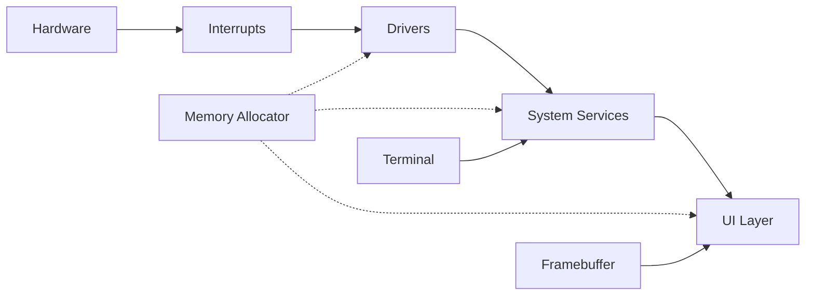

## Introduction

Portix OS is a bare-metal x86_64 kernel written in Rust, designed to boot directly on hardware without relying on an external bootloader or operating system. The kernel demonstrates modern OS development practices including custom memory management, interrupt handling, and a complete driver stack.

<Note>
  Portix OS v0.7.4 is a monolithic kernel that boots from BIOS, transitions through multiple CPU modes, and runs entirely in 64-bit long mode.
</Note>

## High-Level Architecture

The system follows a layered architecture:

```
┌─────────────────────────────────────────┐
│         User Interface Layer           │
│    (Terminal, IDE, File Explorer)      │
├─────────────────────────────────────────┤
│         System Services Layer          │
│  (Console, Graphics, File System)      │
├─────────────────────────────────────────┤
│          Driver Layer                  │
│  (Keyboard, Mouse, ATA, Serial)        │
├─────────────────────────────────────────┤
│        Core Kernel Layer               │
│  (Memory, Interrupts, Scheduling)      │
├─────────────────────────────────────────┤
│       Hardware Abstraction             │
│  (IDT, GDT, Paging, PIC)              │
└─────────────────────────────────────────┘
```

## Directory Structure

The kernel source code is organized into logical modules:

<AccordionGroup>
  <Accordion title="boot/" icon="rocket">
    **Bootloader components** written in x86 assembly:
    - `boot.asm` - Stage 1 bootloader (512 bytes, MBR)
    - `stage2.asm` - Stage 2 bootloader (handles mode transitions)
  </Accordion>

  <Accordion title="kernel/src/arch/" icon="microchip">
    **Architecture-specific code** for x86_64:
    - `idt.rs` - Interrupt Descriptor Table setup
    - `isr_handlers.rs` - Interrupt Service Routines
    - `isr.asm` - Low-level ISR stubs
    - `hardware.rs` - CPU detection and features
  </Accordion>

  <Accordion title="kernel/src/mem/" icon="memory">
    **Memory management subsystem**:
    - `allocator.rs` - Buddy system allocator (O(log N))
    - Implements Rust's `GlobalAlloc` trait
    - Manages heap from 0x400000 with configurable size
  </Accordion>

  <Accordion title="kernel/src/drivers/" icon="plug">
    **Device drivers**:
    - `input/keyboard.rs` - PS/2 keyboard driver
    - `input/mouse.rs` - PS/2 mouse with scrollwheel
    - `storage/ata.rs` - ATA/IDE disk driver
    - `storage/fat32.rs` - FAT32 filesystem
    - `serial.rs` - COM1 serial port (debugging)
    - `bus/pci.rs` - PCI bus enumeration
  </Accordion>

  <Accordion title="kernel/src/graphics/" icon="display">
    **Framebuffer graphics**:
    - `driver/framebuffer.rs` - VESA mode setup
    - `font.rs` - Bitmap font rendering (8x14)
    - Double-buffered rendering at 30 Hz
  </Accordion>

  <Accordion title="kernel/src/console/" icon="terminal">
    **Terminal and command system**:
    - `terminal/mod.rs` - Line-based terminal
    - `terminal/commands/` - Built-in commands
    - `terminal/editor.rs` - Text editor
  </Accordion>

  <Accordion title="kernel/src/ui/" icon="window">
    **User interface components**:
    - `tabs/system.rs` - System information tab
    - `tabs/ide.rs` - Integrated development environment
    - `tabs/explorer.rs` - File browser
    - Chrome and navigation UI
  </Accordion>
</AccordionGroup>

## Module Organization

The kernel's `main.rs` declares the module hierarchy:

```rust kernel/src/main.rs
pub mod arch;       // Architecture-specific (x86_64)
pub mod console;    // Terminal and command processing
pub mod drivers;    // Hardware drivers (input, storage, bus)
pub mod graphics;   // Framebuffer and rendering
pub mod mem;        // Memory management (allocator)
pub mod time;       // PIT timer (100 Hz)
pub mod ui;         // User interface components
pub mod util;       // Formatting and utilities
```

## Component Interaction

Here's how the major components interact during runtime:



<Info>
  All components run in **kernel mode (ring 0)** with full hardware access. There is no user/kernel mode separation in the current design.
</Info>

## Initialization Sequence

The kernel follows a strict initialization order in `rust_main()` (main.rs:192):

<Steps>
  <Step title="Memory Allocator">
    Initialize the buddy allocator to enable dynamic memory allocation
    ```rust
    unsafe { ALLOCATOR.init(); }
    ```
  </Step>

  <Step title="Page Pool">
    Initialize memory pool for UI page management
    ```rust
    init_page_pool();
    ```
  </Step>

  <Step title="Interrupts">
    Set up IDT, GDT, TSS, and enable interrupts
    ```rust
    unsafe { arch::idt::init_idt(); }
    ```
  </Step>

  <Step title="Drivers">
    Initialize serial port, PIT timer (100 Hz), keyboard, and mouse
    ```rust
    drivers::serial::init();
    time::pit::init();
    ```
  </Step>

  <Step title="Hardware Detection">
    Detect CPU features and scan PCI bus
    ```rust
    let hw = arch::hardware::HardwareInfo::detect_all();
    let pci = drivers::bus::pci::PciBus::scan();
    ```
  </Step>

  <Step title="Storage">
    Scan ATA bus and mount FAT32 filesystem
    ```rust
    let ata = ata::AtaBus::scan();
    let vol = fat32::Fat32Volume::mount(drive);
    ```
  </Step>

  <Step title="Main Loop">
    Enter the event loop: process input, render UI, handle events
  </Step>
</Steps>

## Boot Protocol

Portix OS uses a **two-stage bootloader**:

1. **Stage 1** (`boot.asm`) - Loaded by BIOS at 0x7C00, loads Stage 2
2. **Stage 2** (`stage2.asm`) - Switches to long mode, loads kernel
3. **Kernel** - Rust entry point at `rust_main()`

See the [Boot Process](/architecture/boot-process) page for detailed information.

## Memory Layout

<Warning>
  Portix OS uses **identity mapping** for the first 1 GB of physical memory. The framebuffer is mapped separately based on its physical address from VESA.
</Warning>

| Address Range | Usage |
|---------------|-------|
| `0x0000 - 0x0FFF` | Real mode IVT (preserved) |
| `0x1000 - 0x4FFF` | Page tables (PML4, PDPT, PD) |
| `0x6000 - 0x6FFF` | VESA info buffer |
| `0x7C00 - 0x7DFF` | Stage 1 bootloader |
| `0x8000 - 0xFFFF` | Stage 2 bootloader |
| `0x9000 - 0x9FFF` | Boot info structure |
| `0x10000+` | Kernel binary |
| `0x400000+` | Heap (managed by buddy allocator) |
| `0x600000+` | Double-buffer for framebuffer |

## Design Philosophy

<CardGroup cols={2}>
  <Card title="No Dependencies" icon="box">
    Completely `no_std` - no standard library, libc, or external runtime
  </Card>
  <Card title="Bare Metal" icon="wrench">
    Direct hardware access, no hypervisor or firmware dependencies beyond BIOS
  </Card>
  <Card title="Safety First" icon="shield">
    Rust's type system prevents many common OS bugs, with `unsafe` only where needed
  </Card>
  <Card title="Real Hardware" icon="server">
    Designed to boot on real x86_64 hardware (VirtualBox, QEMU, physical machines)
  </Card>
</CardGroup>

## Next Steps

<CardGroup cols={2}>
  <Card title="Boot Process" icon="rocket" href="/architecture/boot-process">
    Learn how Portix OS transitions from BIOS to 64-bit mode
  </Card>
  <Card title="Memory Management" icon="memory" href="/architecture/memory-management">
    Explore the buddy allocator and heap management
  </Card>
  <Card title="Interrupt Handling" icon="bolt" href="/architecture/interrupt-handling">
    Understand how interrupts and exceptions are processed
  </Card>
</CardGroup>
